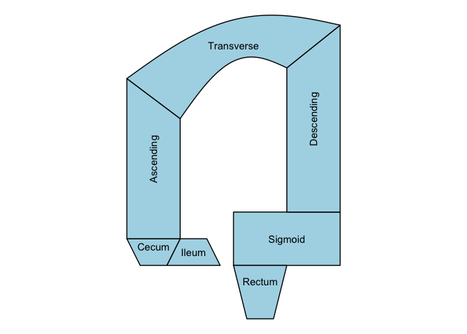

<!-- README.md is generated from README.Rmd. Please edit that file -->

# ggcolonviz

<!-- badges: start -->

<!-- badges: end -->

The goal of ggcolonviz is to provide a ggplot2 extension for visualizing
the colon in a clear and informative way. It offers a set of functions
to create detailed and customizable plots of the colon, allowing users
to easily represent various aspects of colon anatomy and related data.


## Installation

``` r
# install.packages("remotes")
remotes::install_github("Sanofi-Public/ggcolonviz")
```

## Example

Here is a basic example of how to use ggcolonviz to create a simple plot of
the colon:

``` r
library(ggcolonviz)
library(ggplot2)

patient_data <- data.frame(
  x = 0,
  y = 0,
  part = c(
    "Ileum",
    "Cecum",
    "Sigmoid",
    "Ascending",
    "Descending",
    "Transverse",
    "Rectum"
  )
)

patient_data |>
  ggplot(aes(x = x, y = y, part = part)) +
  geom_colon(
    color = "black",
    linewidth = 0.5,
    fill = "lightblue"
  ) +
  geom_colon_label() +
  coord_fixed() +
  theme_void()
```



## Contributing

Contributions are welcome! Please feel free to submit a pull request or
open an issue if you have any suggestions or find any bugs.

## Third-Party Licenses

This package imports [{sf}](https://cran.r-project.org/package=sf), which
is dual-licensed under GPL-2 and MIT. `ggcolonviz` uses `{sf}` under the
**MIT** branch of that dual license.
